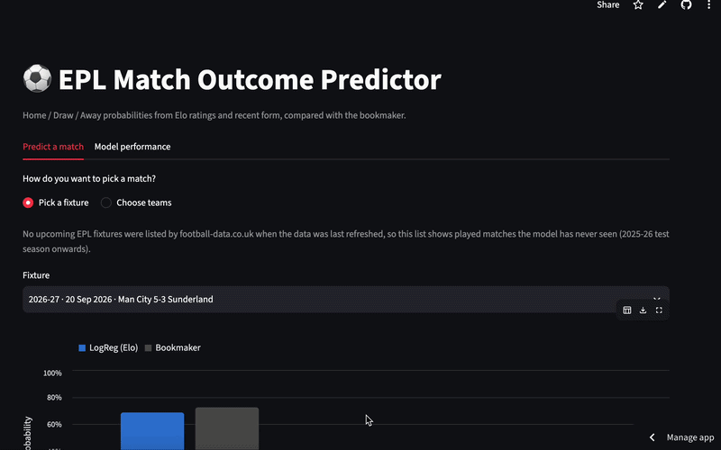
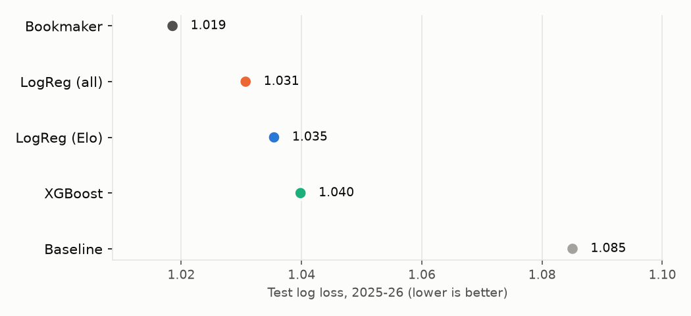
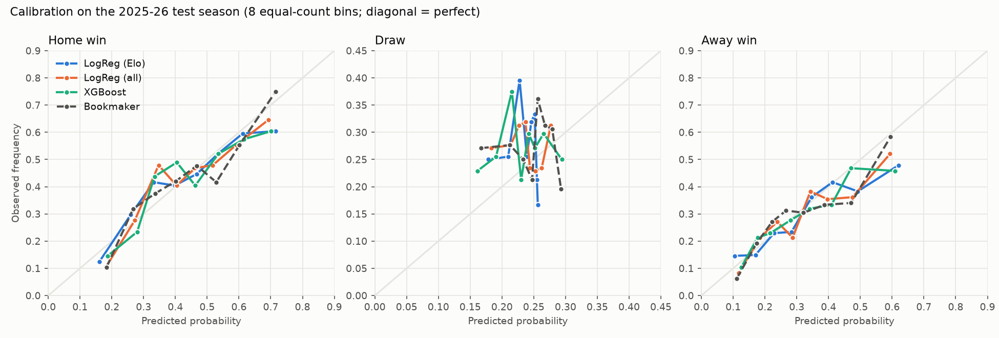

# ⚽ EPL Match Outcome Predictor

**Predicts Home / Draw / Away probabilities for Premier League matches from Elo ratings and recent form, and benchmarks them honestly against bookmaker odds on a season the models have never seen.**

**Live demo:** https://nowayay-epl-predictor.streamlit.app



**TL;DR**
- Elo + recent form gets within ~0.01-0.02 log loss of Bet365's margin-free probabilities on a held-out season (2025-26, 380 matches). The two logistic regressions cannot be statistically distinguished from the bookmaker; XGBoost is likely worse.
- Simple beat complex: a one-feature Elo model was the best on validation, and more features did not help.
- No model, including the bookmaker, ever favours a draw. Leakage is ruled out by automated tests.

## Results

Test season **2025-26** (380 matches, never used for training or tuning). Models trained on 2019-20 to 2024-25. Every model and the bookmaker are scored on exactly the same matches.

| Model | Log loss ↓ | Brier ↓ | Accuracy ↑ | Draws predicted | Log loss vs bookmaker (95% CI) |
|---|---|---|---|---|---|
| Baseline (always the training H/D/A rates) | 1.0851 | 0.6565 | 42.6% | 0 | [+0.033, +0.101] |
| LogReg (Elo difference only) | 1.0354 | 0.6251 | 48.9% | 0 | [-0.003, +0.038] |
| LogReg (all 27 features) | 1.0307 | 0.6217 | 47.4% | 0 | [-0.006, +0.031] |
| XGBoost (all 27 features) | 1.0398 | 0.6271 | 48.4% | 0 | [+0.001, +0.043] |
| **Bookmaker** (Bet365, margin removed) | **1.0185** | **0.6115** | **48.9%** | 0 | reference |

📄 Full write-up: [reports/REPORT.md](reports/REPORT.md)

*Log loss and Brier score judge the full probability distribution and are the main metrics; accuracy only checks the single most likely outcome. The last column is a paired bootstrap interval (1,000 resamples) for model log loss minus bookmaker log loss: an interval that contains 0 means the gap is within noise.*

Validation season **2024-25** (models trained on 2019-20 to 2023-24), which was used to pick the app's default model. It is also the last of the three tuning folds, so it is not fully held out; only the test season is:

| Model | Log loss | Accuracy |
|---|---|---|
| Baseline | 1.0799 | 40.8% |
| LogReg (Elo) | **0.9773** | **54.5%** |
| LogReg (all) | 0.9842 | 53.9% |
| XGBoost | 0.9898 | 54.2% |
| Bookmaker (for reference) | 0.9708 | 53.9% |




## Key findings

- **Nobody beat the bookmaker.** The best model on the test season (LogReg, all features) trails Bet365 by 0.012 log loss. For both logistic regressions the 95% interval of the gap includes zero, so on 380 matches they cannot be told apart from the bookmaker statistically. XGBoost is likely worse (its interval only just excludes zero).
- **XGBoost lost to logistic regression** on both validation and test. Its tuned settings collapsed to depth-1 trees, i.e. an almost linear model. With ~2,000 training matches there is not enough signal for non-linear structure to pay off.
- **Elo does almost all the work.** A one-feature logistic regression on Elo difference was the best model on validation. Adding form features made cross-validated log loss slightly *worse* (0.9639 → 0.9660–0.9693, see [02_model_experiments.ipynb](notebooks/02_model_experiments.ipynb)). On test, the all-features model edged ahead by 0.005, well within noise. The ranking flipping between validation and test is itself a lesson about small samples.
- **Test accuracy (47–49%) is below the typical 52–55%, because 2025-26 was the least predictable season in the data.** Even the bookmaker only reached 48.9%, against 51.8–59.7% in every other season since 2017-18 ([01_eda.ipynb](notebooks/01_eda.ipynb)). It also had the most draws (27.4%) of any completed season. On the more typical 2024-25 validation season the Elo model reached 54.5% accuracy, 0.0065 log loss behind the bookmaker.
- **Draws are invisible to every model, including the bookmaker.** No model, and not the bookmaker, ever makes a draw the most likely outcome (the highest draw probability Bet365 offered in nine seasons was 33.9%), yet 27% of test matches were draws.
- **Home advantage looks crowd-dependent.** In 2020-21, played behind closed doors, away wins (40.3%) outnumbered home wins (37.9%) for the only time in the data (one season, so only suggestive).

## Approach

**Data.** [football-data.co.uk](https://www.football-data.co.uk/) CSVs, one per season, 2017-18 to 2025-26, plus the first 50 matches of 2026-27. `src/data.py` parses mixed date formats (`dayfirst=True, format="mixed"`), maps alternative team spellings to one canonical name, drops empty rows, validates that results match scores and that there are no duplicates, and sorts chronologically. Every completed season has 380 matches, 20 teams and no missing odds.

**Features** (`src/features.py`, 27 in total). Every feature uses only matches before kickoff:
- **Elo**: start 1500, K = 20, home advantage = 70 points. Updates are zero-sum. Each summer, ratings regress one third of the way back to 1500. Promoted teams take over the average rating of the teams relegated that summer (the bottom three of last season's table), which starts them below average and keeps the league mean at exactly 1500 (tested). Outputs `elo_home`, `elo_away`, `elo_diff`, all pre-match.
- **Rolling last-5 form** for each team (points, goals for/against, goal difference, shots, shots on target), computed with `.shift(1)` so a match never sees its own result.
- **Venue-specific form**: the home team's last 5 *home* games and the away team's last 5 *away* games.
- **Rest days** (capped at 14) and **season-to-date points per game**.
- **Early-season fallback**: form windows run across season boundaries, so matchweek 1 uses the end of last season. A team returning after relegation starts a fresh window instead of reusing years-old form. When there is no history at all, form falls back to league-average priors from the two warm-up seasons (2017-18, 2018-19), which are never trained on. The "promoted teams are weaker" signal comes from Elo.
- Bookmaker odds are **not** used as features.

**Split.** Strictly by season, never random. Warm-up: 2017-18 and 2018-19 (features only). Train: 2019-20 to 2023-24. Validation: 2024-25. Test: 2025-26. Hyperparameters (LogReg `C`, XGBoost depth / learning rate / trees) are chosen by **expanding-window validation**: predict 2022-23, 2023-24 and 2024-25, each from a model trained only on earlier seasons. The final models are refit on 2019-20 to 2024-25 with those settings and scored once on 2025-26.

**Models** (`src/train.py`): (1) baseline that always predicts the training H/D/A frequencies, (2) logistic regression on `elo_diff`, (3) scaled logistic regression on all features, (4) XGBoost.

**Evaluation** (`src/evaluate.py`): log loss, multiclass Brier score, accuracy, reliability diagrams per class, and a SHAP summary for XGBoost. The bookmaker benchmark uses Bet365 odds converted to probabilities (1/odds, rescaled to sum to 1).

**Leakage checks** (`tests/test_features.py`): rebuilding the features after scrambling a match's own result *and every later result* leaves that match's features unchanged (tested in two seasons). A guard test confirms the features really do depend on earlier results. Predicting past fixtures through `src/predict.py` reproduces the training features exactly.

## What failed / what I learned

- **More features ≠ better.** I expected rolling form, shots and venue splits to help. They did not: Elo already compresses past results, and 5-match averages are mostly noise.
- **XGBoost was the wrong tool for this data size.** Its first tuning grid picked the smallest settings available, so I widened the grid (using validation only), and it chose depth-1 stumps. Gradient boosting shines with many rows and interactions; ~380 matches per season offer neither.
- **One season is a small test set.** The confidence intervals on the gap to the bookmaker are about ±0.02 log loss, larger than the differences between my models. The validation and test rankings disagreed; the flip is what you would expect when differences between models are smaller than the noise.
- **Accuracy is a misleading headline.** The test season looked "bad" by accuracy, but the bookmaker scored the same 48.9%. Comparing against a strong benchmark on the same matches is what makes a result interpretable.
- **Leakage hides in small places.** Same-day matches, season boundaries and promoted teams all needed care. Writing the "scramble the future" test first made these easy to check.

## Limitations

- No team news: injuries, suspensions, lineups, rotation and manager changes are invisible to the model. The bookmaker sees them, which plausibly explains much of its edge.
- Draws are hard to predict: no model ever favours one.
- Only Premier League matches: rest days ignore cup and European fixtures, and promoted teams have no Championship history.
- Bet365's pre-match odds from football-data are the benchmark, not closing odds from a sharp exchange, so the true market is probably a little stronger still.
- One test season of 380 matches: small differences between models are not statistically meaningful.
- The saved models were trained up to 2024-25. Predictions for 2026-27 use up-to-date features but are not refit on 2025-26.

## Future work

- Expected goals (xG) form instead of goals and shots (football-data added xG columns from 2026-27).
- A Poisson / Dixon-Coles goals model, which handles draws more naturally.
- Tuning Elo's K and home advantage on validation, and a goal-margin multiplier.
- Clearly labelled "model + odds" variant to test whether the model adds anything on top of the market.
- Refit on all completed seasons before predicting the current one, and scheduled data refreshes.

## Run it

Requires **Python 3.12+** (the pinned numpy, XGBoost and SHAP versions need it).

```bash
python -m venv .venv && source .venv/bin/activate
pip install -r requirements.txt

python -m src.data       # download all seasons -> data/processed/matches.csv + per-season summary
python -m src.train      # tune with expanding-window CV, print validation scores, save models/
python -m src.evaluate   # test-season results table, figures, SHAP -> reports/
python -m src.predict    # upcoming EPL fixtures (if listed) vs bookmaker
python -m src.predict --home Arsenal --away Chelsea   # any custom pairing

pytest                   # 38 tests: leakage, zero-sum Elo, split, probabilities, cleaning
streamlit run app/streamlit_app.py
```

The app needs only committed files (`data/processed/`, `models/`, `reports/`), so it runs straight after `pip install`. The notebooks ([01_eda](notebooks/01_eda.ipynb), [02_model_experiments](notebooks/02_model_experiments.ipynb)) are saved with outputs; re-running them needs Jupyter (`pip install notebook`). All random seeds are fixed (`SEED = 42`), and re-running the pipeline reproduces the same numbers to within rounding. LogReg results are exact; XGBoost can differ slightly across platforms (a Linux re-run moved test log loss by 0.0002 and validation accuracy by 0.5 points).

**Deploying:** see [DEPLOY.md](DEPLOY.md) for Streamlit Community Cloud steps.

**macOS troubleshooting:** if `import xgboost` fails with `libomp.dylib could not be loaded`, run `brew install libomp`.

## License

[MIT](LICENSE)

## Project structure

```
src/data.py        download + clean + validate -> data/processed/matches.csv
src/features.py    Elo, rolling form, rest days, season PPG (all pre-match)
src/train.py       time-based split, expanding-window tuning, saves models/
src/evaluate.py    metrics, bookmaker benchmark, figures, SHAP -> reports/
src/predict.py     features for future fixtures from past matches only
app/               Streamlit demo
notebooks/         01_eda (data + bookmaker yardstick), 02_model_experiments (ablation, tuning, draws)
tests/             pytest suite
```

## Judgment calls

- **2026-27 data**: the season in progress (50 matches when the data was downloaded) is used only as history for predicting upcoming fixtures. It is never used for training or evaluation.
- **Python 3.12+ instead of 3.11+**, because the current numpy, XGBoost and SHAP releases require it. Versions are pinned exactly so the committed models load reliably.
- **Elo details**: season regression of one third, and promoted teams inheriting the relegated teams' average rating, are common conventions, not tuned values.
- **LogReg was tuned too** (its `C`, on the same CV folds as XGBoost) so the comparison is fair.
- **The app's default model** is the best on *validation* (LogReg Elo), not on test.
- **Optional extras**: rest days and season PPG are included; head-to-head and the optional "model + odds" variant are left out to keep things simple.
- **Altair** draws the app's probability chart. It is installed with Streamlit, so no extra dependency.
- **Upcoming fixtures**: when the data was refreshed (7 Oct 2026, an international break), football-data listed no EPL fixtures, so `data/processed/fixtures.csv` is empty. The app falls back to out-of-sample played matches and custom pairings. Re-run `python -m src.predict` to refresh it.
