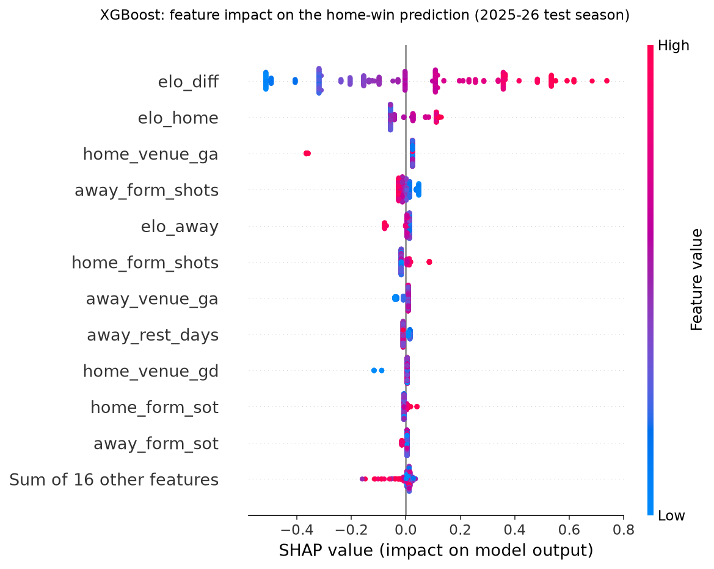

# EPL Match Outcome Predictor: Final Report

**Scope:** Home/Draw/Away probability models for English Premier League matches, benchmarked against Bet365 odds
**Test season:** 2025-26 (380 matches, held out from all training and tuning)
**Data:** football-data.co.uk, 2017-18 to 2025-26 plus the first 50 matches of 2026-27 (data refreshed 7 Oct 2026)

All figures in this report come from running the code in this repository (`python -m src.evaluate`, `python -m src.train` and the two notebooks). Re-running the pipeline from a fresh clone reproduces them exactly (`SEED = 42`).

---

## 1. Summary

- **The bookmaker remains the best forecaster.** On the 2025-26 test season Bet365 scored a log loss of **1.0185**. The best model, a logistic regression on all features, scored **1.0307**, a gap of 0.012.
- **The two logistic regressions are statistically indistinguishable from the bookmaker** on 380 matches: the 95% bootstrap interval of their gap includes zero. **XGBoost is measurably worse** than the bookmaker.
- **Simple beat complex.** XGBoost lost to logistic regression on both validation and test, and a one-feature model (Elo difference) was the best model on validation.
- **Accuracy of 47–49% reflects an unusually unpredictable season, not a broken model.** Bet365 also managed only 48.9% in 2025-26, against 51.8–59.7% in every other season since 2017-18. On the 2024-25 validation season, the Elo model reached **54.5%**, compared with the bookmaker's 53.9%.
- **No forecaster ever predicts a draw**, including the bookmaker, although 27.4% of test matches were draws.
- **No leakage.** Automated tests prove that changing a match's own result, or any later result, leaves its features unchanged.

---

## 2. Data

| Item | Value |
|---|---|
| Source | `https://www.football-data.co.uk/mmz4281/{season}/E0.csv` |
| Seasons | 2017-18 to 2025-26 (9 complete seasons), plus 2026-27 to date |
| Matches | 3,470 (380 per completed season, 50 in 2026-27) |
| Teams per season | 20 |
| Missing Bet365 odds | 0 |
| Missing match statistics | 0 |

Cleaning (`src/data.py`) parses mixed `dd/mm/yy` and `dd/mm/yyyy` dates, maps alternative team spellings to one name, drops empty rows, and validates that each result matches the score, that no team plays itself and that there are no duplicates. Matches are sorted chronologically before any feature is built.

**Outcome rates by season.** Home wins are the most common result, but home advantage varies. In 2020-21, played behind closed doors, away wins outnumbered home wins.

| Season | Home win | Draw | Away win |
|---|---|---|---|
| 2017-18 | 45.5% | 26.1% | 28.4% |
| 2018-19 | 47.6% | 18.7% | 33.7% |
| 2019-20 | 45.3% | 24.2% | 30.5% |
| 2020-21 | 37.9% | 21.8% | **40.3%** |
| 2021-22 | 42.9% | 23.2% | 33.9% |
| 2022-23 | 48.4% | 22.9% | 28.7% |
| 2023-24 | 46.1% | 21.6% | 32.4% |
| 2024-25 | 40.8% | 24.5% | 34.7% |
| 2025-26 | 42.6% | **27.4%** | 30.0% |

---

## 3. Method

### 3.1 Features (27, all known before kickoff)

| Group | Features | Notes |
|---|---|---|
| Elo (3) | `elo_home`, `elo_away`, `elo_diff` | Start 1500, K = 20, home advantage 70. Zero-sum updates. Ratings regress ⅓ toward 1500 each summer. Promoted teams inherit the relegated teams' average rating. |
| Last-5 form (12) | points, goals for, goals against, goal difference, shots, shots on target, for each team | `.shift(1)` so a match never sees its own result |
| Venue form (8) | points, goals for/against, goal difference, from the home team's last 5 home games and the away team's last 5 away games | |
| Other (4) | rest days (capped at 14), season-to-date points per game | |

**Early-season handling.** Form windows run across season boundaries, so matchweek 1 uses the end of the previous season. A team returning after relegation starts a fresh window instead of reusing years-old form. Missing history falls back to league-average priors computed from the two warm-up seasons, which are never trained on.

Bookmaker odds are **not** used as model inputs; they appear only as the benchmark.

### 3.2 Split and tuning

| Role | Seasons | Matches |
|---|---|---|
| Warm-up (feature history only) | 2017-18, 2018-19 | 760 |
| Train | 2019-20 to 2023-24 | 1,900 |
| Validation | 2024-25 | 380 |
| Test | 2025-26 | 380 |
| Prediction history only | 2026-27 to date | 50 |

Hyperparameters were chosen by **expanding-window validation**: predict 2022-23, 2023-24 and 2024-25, each with a model trained only on earlier seasons. Final models were refit on 2019-20 to 2024-25 and scored once on 2025-26.

| Model | Tuned setting (expanding-window CV) |
|---|---|
| Baseline | none (predicts the training H/D/A frequencies) |
| LogReg (Elo) | C = 1.0 |
| LogReg (all, scaled) | C = 0.01 |
| XGBoost | max_depth = 1, learning_rate = 0.02, n_estimators = 400 |

### 3.3 Metrics

- **Log loss** (primary): penalises confident wrong probabilities.
- **Multiclass Brier score**: squared error over the three outcomes (0 = perfect, 2 = worst).
- **Accuracy**: share of matches where the most likely outcome happened.
- **Bookmaker benchmark**: Bet365 decimal odds converted to probabilities (1/odds, rescaled to sum to 1, which removes the average 5.5% margin), scored on the same matches.
- **Paired bootstrap** (1,000 resamples): 95% interval for model log loss minus bookmaker log loss.

---

## 4. Results

### 4.1 Test season 2025-26

| Model | Log loss ↓ | Brier ↓ | Accuracy ↑ | Draws predicted | Log loss vs bookmaker (95% CI) |
|---|---|---|---|---|---|
| Baseline | 1.0851 | 0.6565 | 42.6% | 0 | [+0.033, +0.101] |
| LogReg (Elo) | 1.0354 | 0.6251 | 48.9% | 0 | [-0.003, +0.038] |
| LogReg (all) | 1.0307 | 0.6217 | 47.4% | 0 | [-0.006, +0.031] |
| XGBoost | 1.0398 | 0.6271 | 48.4% | 0 | [+0.001, +0.043] |
| **Bookmaker** | **1.0185** | **0.6115** | **48.9%** | 0 | reference |

**How the forecasters pick outcomes (test season).** The models behave much like the bookmaker. They agree with its favourite in 87–88% of matches and, like it, never favour a draw.

| Forecaster | Home picks | Away picks | Draw picks | Home picks correct | Away picks correct | Same pick as bookmaker |
|---|---|---|---|---|---|---|
| Baseline | 380 | 0 | 0 | 42.6% | – | 65.0% |
| LogReg (Elo) | 228 | 152 | 0 | 52.6% | 43.4% | 88.2% |
| LogReg (all) | 239 | 141 | 0 | 51.0% | 41.1% | 87.4% |
| XGBoost | 239 | 141 | 0 | 51.9% | 42.6% | 87.4% |
| Bookmaker | 247 | 133 | 0 | 51.8% | 43.6% | 100% |

Average predicted probabilities match the actual outcome mix closely. For example, LogReg (all) averages 43.3% / 23.7% / 33.0% for H/D/A, against actual rates of 42.6% / 27.4% / 30.0%. Every forecaster underestimated the draw rate of this unusually draw-heavy season.

### 4.2 Validation season 2024-25

Models trained on 2019-20 to 2023-24 only.

| Model | Log loss | Accuracy |
|---|---|---|
| Baseline | 1.0799 | 40.8% |
| **LogReg (Elo)** | **0.9773** | **54.5%** |
| LogReg (all) | 0.9842 | 53.9% |
| XGBoost | 0.9898 | 54.2% |
| Bookmaker (reference) | 0.9708 | 53.9% |

LogReg (Elo) was the best model on validation, so it is the default model in the app. On test, LogReg (all) edged ahead by 0.005 log loss. That difference is well within noise, and the swap in ranking shows how little separates these models.

### 4.3 Context: how predictable was each season?

The bookmaker's own performance by season shows that 2025-26 was the hardest season in the data:

| Season | Bookmaker log loss | Bookmaker accuracy |
|---|---|---|
| 2017-18 | 0.9455 | 55.3% |
| 2018-19 | 0.8929 | 58.7% |
| 2019-20 | 0.9732 | 52.9% |
| 2020-21 | 1.0070 | 51.8% |
| 2021-22 | 0.9372 | 58.2% |
| 2022-23 | 0.9662 | 55.8% |
| 2023-24 | 0.9092 | 59.7% |
| 2024-25 | 0.9708 | 53.9% |
| **2025-26** | **1.0185** | **48.9%** |

### 4.4 Calibration

For home and away wins, all models track the diagonal about as well as the bookmaker: a predicted 60% happens roughly 60% of the time. Draw probabilities sit in a narrow band (about 15–30%) where the observed frequency is noisy for every forecaster.

### 4.5 What drives the predictions

In XGBoost, `elo_diff` alone accounts for 46% of the mean absolute SHAP value, and the three Elo columns together account for 64%. The largest non-Elo contributors are the away team's recent goals scored and shots, at about 6% and 4%.

### 4.6 Experiments (validation folds only)

**Feature ablation**: logistic regression, best C per feature set, expanding-window CV log loss:

| Feature set | Features | Best C | CV log loss |
|---|---|---|---|
| Elo difference only | 1 | 1.00 | 0.9647 |
| All Elo columns | 3 | 1.00 | **0.9639** |
| Elo + last-5 form | 15 | 0.01 | 0.9660 |
| Elo + home/away form | 11 | 0.03 | 0.9666 |
| All features | 27 | 0.01 | 0.9693 |

Adding form features made the score slightly worse. Elo already summarises past results, and 5-match averages mostly add noise.

**XGBoost tuning.** The first grid chose its most constrained corner, so the grid was widened, still using validation folds only. The final choice was depth-1 trees (stumps). Top settings (CV log loss): depth 1 / lr 0.02 / 400 trees = 0.9723; depth 1 / lr 0.05 / 200 = 0.9728; depth 2 / lr 0.01 / 400 = 0.9731. With about 2,000 training matches, the data supports only simple additive effects.

---

## 5. Validity checks

| Check | How it is verified | Status |
|---|---|---|
| No leakage from a match's own or later results | Scramble the result and stats of a match and every later match, rebuild features, compare (tested in 2019-20 and 2025-26) | Pass |
| Features really use past results | Scrambling earlier results must change later features | Pass |
| Elo is zero-sum | Per-update test, plus league-average rating stays exactly 1500 at every season start | Pass |
| Time split has no overlap | Last train date < first validation date < first test date | Pass |
| Probabilities are valid | Every saved model's H/D/A probabilities sum to 1 | Pass |
| Bookmaker normalisation | Implied probabilities sum to 1 after removing the margin | Pass |
| Fixture predictions use history before kickoff only | `src/predict.py` reproduces the training features exactly for past fixtures | Pass |
| Data cleaning | Mixed date formats, name normalisation, sorting, validation errors | Pass |
| Reproducibility | Fresh clone → download → train → evaluate gives identical results files | Pass |

Test suite: **35 passed**.

---

## 6. Limitations

- **No team news.** Injuries, suspensions, lineups, rotation and manager changes are invisible to the models. The bookmaker sees them, which explains much of its edge.
- **Draws.** No forecaster ever favours a draw, so roughly a quarter of matches can never be "correct" on accuracy.
- **Premier League only.** Rest days ignore cup and European games, and promoted teams have no Championship history.
- **Benchmark.** The benchmark is Bet365's pre-match odds, not closing odds from a sharp exchange, so the true market is likely slightly stronger.
- **Sample size.** One test season of 380 matches gives bootstrap intervals of about ±0.02 log loss, wider than the differences between the models.
- **Model freshness.** Saved models are trained through 2024-25. Predictions for 2026-27 use current features but are not refit on 2025-26.

## 7. Next steps

1. Use expected goals (xG) form; football-data includes xG from 2026-27.
2. Try a Poisson / Dixon-Coles goals model, which handles draws more naturally.
3. Tune Elo's K and home advantage on validation folds, and add a goal-margin multiplier.
4. Build a clearly labelled "model + odds" variant to test whether the model adds information beyond the market.
5. Refit on all completed seasons before predicting the current one, and refresh data on a schedule.

## 8. Conclusion

A transparent, leak-free pipeline built mostly on Elo ratings gets within about 0.01 log loss of a major bookmaker. On a single test season that gap cannot be distinguished from zero for the logistic regression models. More features and a more flexible model (XGBoost) did not improve on the simple approach. The remaining gap is most plausibly information the models never see: team news and lineups.
